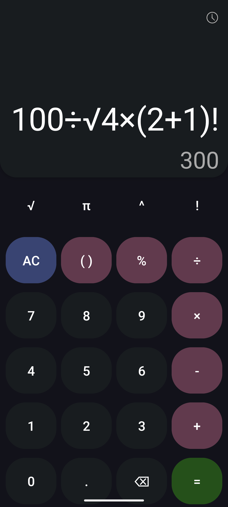
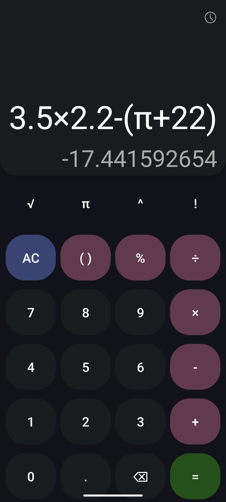
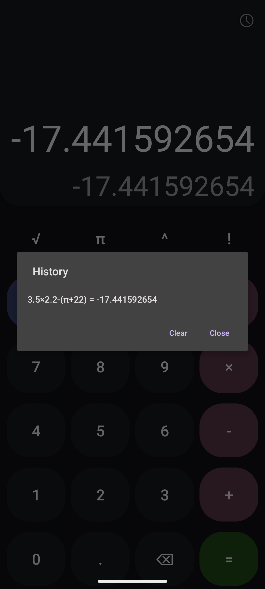

# Calculator

Простой, но функциональный калькулятор для Android, разработанный на Java. Приложение поддерживает стандартные арифметические операции, а также некоторые научные функции.

## Скриншоты

<p align="center">
  
  
  
</p>

## Функционал

*   **Основные арифметические операции:**
    *   Сложение (+)
    *   Вычитание (-)
    *   Умножение (×)
    *   Деление (÷)
*   **Дополнительные операции:**
    *   Возведение в степень (^)
    *   Извлечение квадратного корня (√)
    *   Вычисление факториала (!)
    *   Проценты (%)
    *   Число Пи (π)
*   **Работа со скобками:** Поддержка вложенных скобок для изменения порядка операций.
*   **Десятичные числа:** Ввод и вычисление с десятичными дробями.
*   **Отображение выражения:** Показывает вводимое выражение.
*   **Предварительный просмотр результата:** Динамически отображает результат вычисления по мере ввода (если выражение корректно).
    *   *(Если вы оставили это поведение:)* При нажатии "=" отображается только итоговый результат в основном поле, а поле предварительного просмотра очищается.
*   **История вычислений:**
    *   Доступ к истории последних вычислений через меню.
    *   Возможность очистить историю.
    *   Возможность вставить выражение из истории для повторного вычисления или редактирования.
*   **Автоматическое изменение размера текста:** Текст в полях ввода и отображения результата автоматически подстраивается под доступное пространство.
*   **Обработка ошибок:** Отображение сообщений об ошибках при некорректном вводе или математически недопустимых операциях (например, деление на ноль).
*   **Полноэкранный режим:** Приложение запускается в полноэкранном режиме, скрывая системную строку состояния.

## Технологии

*   **Язык:** Java
*   **Платформа:** Android
*   **Основные компоненты Android SDK:**
    *   `AppCompatActivity`
    *   `Toolbar`
    *   `GridLayout`, `RelativeLayout` для разметки
    *   `MaterialButton` для кнопок
    *   `AlertDialog` для диалоговых окон
*   **Пользовательский компонент:** `AutoResizeTextView` для автоматического изменения размера текста.
*   **Парсер выражений:** Рекурсивный парсер для анализа и вычисления математических выражений.

## Сборка и запуск

1.  **Клонируйте репозиторий:**
    ```bash
    git clone https://github.com/daniladikan2000/Calculator.git
    ```
2.  **Откройте проект в Android Studio.**
3.  **Соберите проект:** Android Studio должна автоматически загрузить все необходимые зависимости (если используется Gradle).
4.  **Запустите приложение** на эмуляторе Android или подключенном физическом устройстве.

## Возможные улучшения (To-Do)

*   [ ] Добавить поддержку тем (светлая/темная).
*   [ ] Реализовать тригонометрические функции (sin, cos, tan).
*   [ ] Добавить логарифмы.
*   [ ] Улучшить дизайн и пользовательский интерфейс.
*   [ ] Добавить тесты для парсера и основной логики.
*   [ ] Локализация на другие языки.

